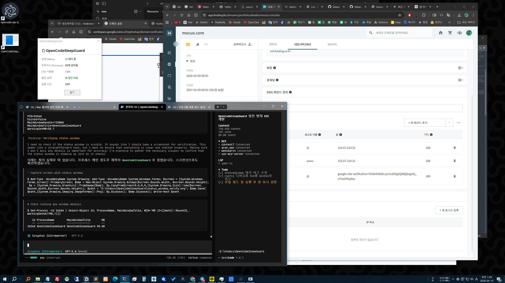

# OpenCodeSleepGuard

OpenCodeSleepGuard is a lightweight background utility that keeps Windows from entering sleep or display-off mode while OpenCode is actively running agent coding sessions. This ensures your work completes without interruption. Once the session ends or OpenCode becomes inactive, the app releases the sleep prevention, allowing Windows to resume your original power and sleep settings automatically.

## Features

- **Sleep Prevention** — Monitors OpenCode's SQLite DB for `step-start` events and prevents the system from sleeping while work is underway
- **Sleep Restoration** — Detects `step-finish(reason: stop)` events and releases sleep prevention, letting Windows return to normal behavior
- **Auto-exit** — When the OpenCode process exits, the app restores sleep settings and shuts down cleanly
- **System Tray** — Shows current work status at a glance (🟢 Active / ⚪ Idle)
- **Dark-mode Status Window** — View session, agent, task, event, and sleep status all in one place
- **Auto-start** — Register to launch automatically on Windows logon
- **Lightweight** — CPU < 1%, Memory < 50MB

## Screenshots

### Dark-mode Status Window

Example of the latest status window.



## Installation

### Download from Releases

Grab the latest release from the [Releases](../../releases) page.

### Build from Source

```bash
git clone https://github.com/your-user/OpenCodeSleepGuard.git
cd OpenCodeSleepGuard
dotnet build -c Release
```

Build output: `bin/Release/net8.0-windows/OpenCodeSleepGuard.exe`

## Usage

### Running the App

```bash
# Direct execution
OpenCodeSleepGuard.exe
```

On launch, an icon appears in the system tray:
- 🟢 Green: OpenCode is working (sleep is blocked)
- ⚪ Gray: OpenCode is idle (sleep is allowed)

Double-click or right-click the tray icon to open the status window.

### Status Window

The status window uses a dark-mode UI and displays:

- **Status** — `🟢 Active` / `⚪ Idle` / `⚪ No Process`
- **Sleep Status** — `🔒 Preventing Sleep` / `🔓 Allowing Sleep`
- **Session Info** — Detected OpenCode session title
- **Agent Info** — Agent/mode info from the most recent message
- **Task Info** — Recent tool or part type
- **Recent Events** — e.g., `step-start detected`, `step-finish(stop) detected`
- **Last Activity** — e.g., `3 seconds ago`, `2 minutes ago`, `1 hour ago`

Right-click the tray icon and choose **Exit** to close the app.

### Auto-start Registration

```bash
# Register (requires admin)
OpenCodeSleepGuard.exe --install

# Unregister
OpenCodeSleepGuard.exe --uninstall
```

## Settings

Configuration can be customized via `appsettings.json`, which must live in the same directory as the EXE.

```json
{
  "ProcessNames": ["opencode", "node"],
  "CheckIntervalSeconds": 5,
  "DbPath": ""
}
```

| Setting | Default | Description |
|---------|---------|-------------|
| `ProcessNames` | `["opencode", "node"]` | Process names to monitor |
| `CheckIntervalSeconds` | `5` | Polling interval in seconds |
| `DbPath` | `%USERPROFILE%\.local\share\opencode\opencode.db` | OpenCode SQLite DB path. When blank, the default path is used |

## Tech Stack

- **Language**: C# .NET 8
- **Target OS**: Windows 10/11
- **Sleep API**: `SetThreadExecutionState` (kernel32.dll)
- **Status Detection**: Polling OpenCode SQLite DB (`part` table)
- **SQLite Access**: `Microsoft.Data.Sqlite`
- **UI**: Windows Forms dark-mode status window
- **Process Detection**: `Process.GetProcessesByName()`

## Project Structure

```
OpenCodeSleepGuard/
├── Program.cs          — Entry point, main loop, lifecycle management
├── AppSettings.cs      — Settings model + JSON loader
├── SleepManager.cs     — SetThreadExecutionState P/Invoke wrapper
├── OpenCodeDbMonitor.cs — OpenCode DB status monitoring
├── ProcessWatcher.cs   — OpenCode process detection
├── TrayIcon.cs         — System tray icon
├── TaskScheduler.cs    — Auto-start registration/removal
├── appsettings.json    — Settings file
└── OpenCodeSleepGuard.csproj
```

## Requirements

- .NET 8.0 runtime (or self-contained build)
- Windows 10/11

## License

MIT

---

# Korean / 한국어

OpenCodeSleepGuard는 OpenCode가 에이전트 코딩 세션을 활발히 수행하는 동안 Windows가 절전 또는 화면 끄기 모드에 들어가지 않도록 방지하는 가벼운 백그라운드 유틸리티입니다. 이를 통해 작업이 중단 없이 끝까지 완료될 수 있습니다. 세션이 끝나거나 OpenCode가 더 이상 활성 상태가 아니면, 앱이 절전 방지를 해제하여 Windows가 기존 전원 및 절전 설정을 자동으로 다시 따르도록 합니다.

## 기능

- **절전 방지** — OpenCode의 SQLite DB에서 `step-start` 이벤트를 감시하고, 작업 진행 중 시스템이 절전 모드에 들어가지 않도록 방지
- **절전 복원** — `step-finish(reason: stop)` 이벤트를 감지하면 절전 방지를 해제하여 Windows가 정상 동작으로 복귀
- **자동 종료** — OpenCode 프로세스가 종료되면 절전 설정을 복원하고 깔끔하게 종료
- **시스템 트레이** — 작업 상태를 한눈에 확인 (🟢 작업 중 / ⚪ 대기 중)
- **다크모드 상태 창** — 세션, 에이전트, 작업, 이벤트, 절전 상태를 한 곳에서 확인
- **자동시작** — Windows 로그온 시 자동으로 실행되도록 등록
- **저자원** — CPU < 1%, 메모리 < 50MB

## 스크린샷

### 다크모드 상태 창

최종 버전 상태 창 예시입니다.


## 설치

### 릴리즈에서 다운로드

[Releases](../../releases) 페이지에서 최신 버전을 다운로드하세요.

### 직접 빌드

```bash
git clone https://github.com/your-user/OpenCodeSleepGuard.git
cd OpenCodeSleepGuard
dotnet build -c Release
```

빌드 결과: `bin/Release/net8.0-windows/OpenCodeSleepGuard.exe`

## 사용법

### 실행

```bash
# 직접 실행
OpenCodeSleepGuard.exe
```

실행하면 시스템 트레이에 아이콘이 나타납니다.
- 🟢 초록: OpenCode가 작업 중 (절전 방지)
- ⚪ 회색: OpenCode가 대기 중 (절전 허용)

트레이 아이콘 더블클릭 또는 우클릭 메뉴로 상태 창을 열 수 있습니다.

### 상태 창

상태 창은 다크모드 UI로 다음 정보를 표시합니다.

- **상태** — `🟢 작업 중` / `⚪ 대기 중` / `⚪ 프로세스 없음`
- **절전 상태** — `🔒 절전 방지 중` / `🔓 절전 허용`
- **세션 정보** — 현재 감지된 OpenCode 세션 제목
- **에이전트 정보** — 최근 메시지의 에이전트/모드 정보
- **작업 정보** — 최근 tool 또는 part type 정보
- **최근 이벤트** — 예: `step-start 감지`, `step-finish(stop) 감지`
- **마지막 활동** — 예: `3초 전`, `2분 전`, `1시간 전`

트레이 아이콘 우클릭 → **Exit**으로 종료합니다.

### 자동시작 등록

```bash
# 등록 (관리자 권한 필요)
OpenCodeSleepGuard.exe --install

# 해제
OpenCodeSleepGuard.exe --uninstall
```

## 설정

`appsettings.json`으로 설정을 변경할 수 있습니다. EXE와 같은 디렉토리에 위치해야 합니다.

```json
{
  "ProcessNames": ["opencode", "node"],
  "CheckIntervalSeconds": 5,
  "DbPath": ""
}
```

| 설정 | 기본값 | 설명 |
|------|--------|------|
| `ProcessNames` | `["opencode", "node"]` | 감시할 프로세스 이름 |
| `CheckIntervalSeconds` | `5` | 상태 확인 간격 (초) |
| `DbPath` | `%USERPROFILE%\.local\share\opencode\opencode.db` | OpenCode SQLite DB 경로. 빈 값이면 기본 경로 사용 |

## 기술 스택

- **언어**: C# .NET 8
- **대상 OS**: Windows 10/11
- **절전 API**: `SetThreadExecutionState` (kernel32.dll)
- **상태 감지**: OpenCode SQLite DB (`part` 테이블) 폴링
- **SQLite 접근**: `Microsoft.Data.Sqlite`
- **UI**: Windows Forms 다크모드 상태 창
- **프로세스 감지**: `Process.GetProcessesByName()`

## 프로젝트 구조

```
OpenCodeSleepGuard/
├── Program.cs          — 진입점, 메인 루프, 생명주기 관리
├── AppSettings.cs      — 설정 모델 + JSON 로더
├── SleepManager.cs     — SetThreadExecutionState P/Invoke 래퍼
├── OpenCodeDbMonitor.cs — OpenCode DB 상태 감지
├── ProcessWatcher.cs   — OpenCode 프로세스 감지
├── TrayIcon.cs         — 시스템 트레이 아이콘
├── TaskScheduler.cs    — 자동시작 등록/해제
├── appsettings.json    — 설정 파일
└── OpenCodeSleepGuard.csproj
```

## 요구사항

- .NET 8.0 런타임 (또는 자체 포함 빌드)
- Windows 10/11

## 라이선스

MIT
